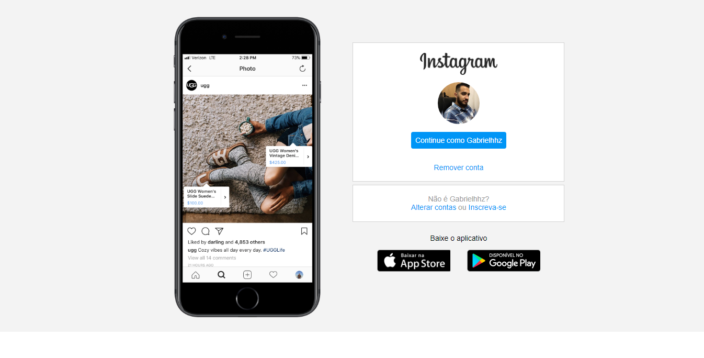

# Instagram-Pagina-Home
<h1 align="center">
  
</h1>

<h3 align="center">Projeto do Bootcamp Digital Innovation One.</h3>

Projeto visa recriar uma copia da tela inicial de login do Instagram.

### 🛠 Tecnologias
As seguintes ferramentas foram usadas na construção do projeto:

- [HTML]()
- [CSS]()

<h1 align="center">
  
</h1>

https://instagram-pagina-home.netlify.app/

Feito por Gabriel Assana 👋🏽 Entre em contato!

